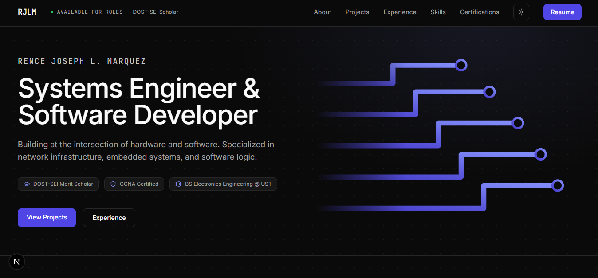
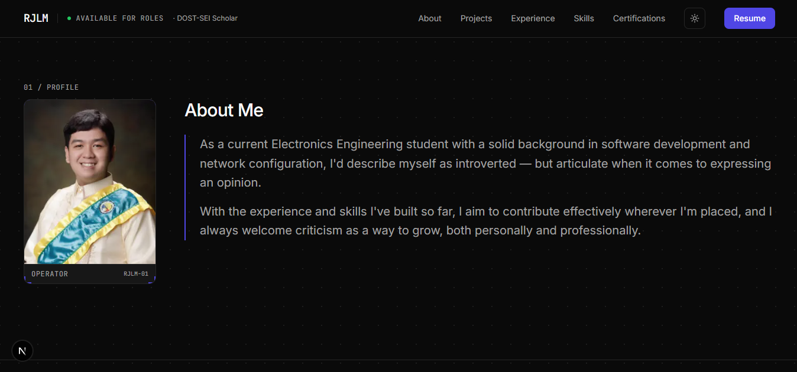
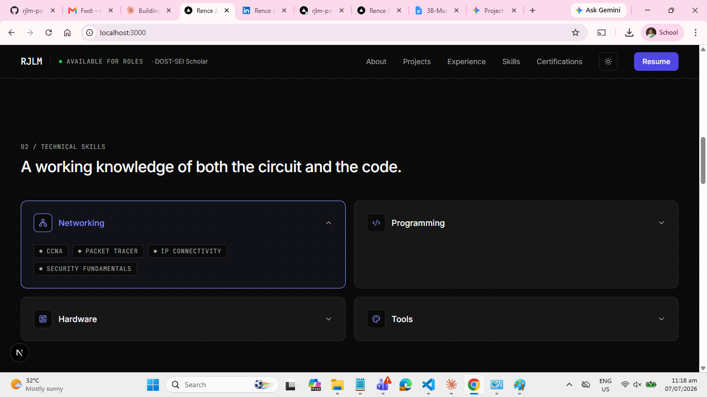
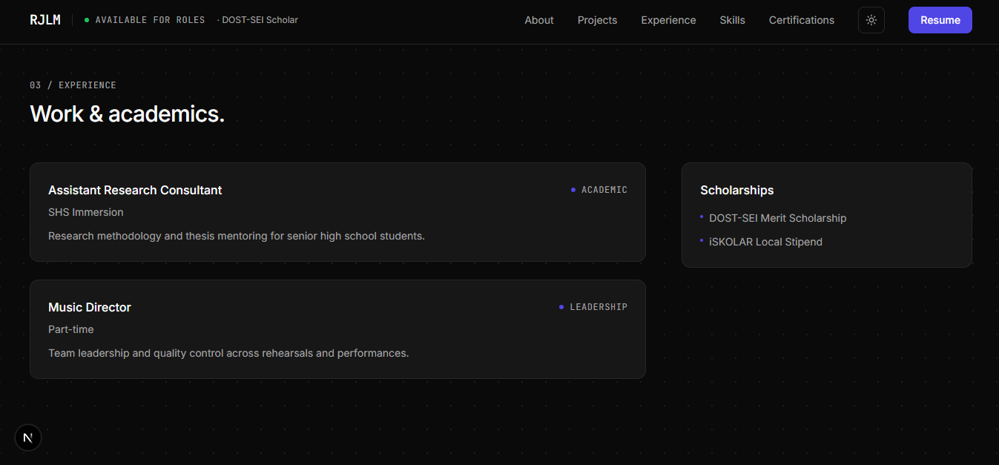
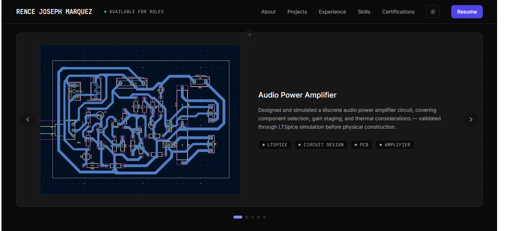

# Rence's Portfolio

Personal portfolio site for **Rence Joseph L. Marquez** — Electronics Engineering student, systems engineer, and software developer. Built with Next.js (App Router), Tailwind CSS v4, and Framer Motion.

link: https://rjlm-portfolio.vercel.app/

---

## Preview

**Hero**


**About**


**Skills**


**Experience**


**Featured Project**


---

## 1. Planning & Concept

The site is built around one core idea: **the intersection of hardware and software.** Every visual choice reinforces this —

- A **circuit/schematic motif** (thick rounded traces, ringed nodes) instead of generic tech-portfolio graphics
- A **mono/sans type pairing** — JetBrains Mono for labels and data-style text (eyebrows, tags, timestamps), Inter for everything readable
- A **hairline-bordered "panel" system** instead of drop shadows — cards read like instrument panels or spec sheets, not soft SaaS UI
- **Two themes**: dark (default) and a warm, cozy light mode — not a cold gray light mode

The page is structured as a single scrolling page (`/`), divided into numbered sections (visible as small "01 / About", "02 / Skills" eyebrow labels), navigated via anchor links in a sticky navbar.

---

## 2. Tech Stack

| Tool | Purpose |
|---|---|
| **Next.js 14** (App Router) | Framework, routing, image optimization |
| **React 18** | UI |
| **TypeScript** | Type safety |
| **Tailwind CSS v4** | Styling — uses the new CSS-first `@theme inline` config, no `tailwind.config.js` needed |
| **Framer Motion** | Scroll-in animations, staggered reveals, the animated circuit graphic, Skills accordion |
| **lucide-react** | Icon set (note: brand/logo icons like GitHub/LinkedIn were removed in v1.0 — those are hand-written inline SVGs instead, see `Footer.tsx`) |
| **clsx** + **tailwind-merge** | Combined into a `cn()` helper for safely merging conditional Tailwind classes |

---

## 3. Project Structure

```
rjlm-portfolio/
├── app/
│   ├── layout.tsx        # Root layout — fonts, metadata
│   ├── page.tsx           # Assembles all sections in order
│   └── globals.css       # Design tokens, theme variables, utility classes
│
├── components/
│   ├── sections/          # One file per page section (see Part 4 below)
│   │   ├── Navbar.tsx
│   │   ├── Hero.tsx
│   │   ├── About.tsx
│   │   ├── Skills.tsx
│   │   ├── Experience.tsx
│   │   ├── FeaturedProject.tsx
│   │   ├── Certifications.tsx
│   │   └── Footer.tsx
│   │
│   └── ui/                # Small reusable building blocks, used across sections
│       ├── Container.tsx  # Horizontal max-width + padding wrapper
│       ├── Panel.tsx      # The hairline-bordered card surface
│       ├── DataLabel.tsx  # Mono/uppercase small text (eyebrows, tags)
│       ├── Section.tsx    # Optional section wrapper (divider + vertical rhythm)
│       └── ThemeToggle.tsx # Dark/light switch, persists choice in localStorage
│
├── lib/
│   ├── utils.ts            # cn() class-merging helper
│   └── fonts.ts            # next/font setup for Inter + JetBrains Mono
│
├── public/
│   ├── resume.pdf                          # ← you provide this
│   ├── images/
│   │   ├── profile.jpg                     # ← you provide this
│   │   ├── projects/
│   │   │   └── power-amp-schematic.png     # ← you provide this
│   │   └── badges/
│   │       ├── ccna-introduction-to-networks.png                  # ← you provide this
│   │       └── ccna-switching-routing-wireless-essentials.png     # ← you provide this
│
├── docs/
│   └── screenshots/        # Images used in this README's Preview section
│
├── package.json
├── tsconfig.json
├── next.config.mjs
├── postcss.config.mjs        # Tailwind v4 plugin registration
└── .gitignore                 # excludes node_modules, .next, .env
```

---

## 4. Page Sections (in scroll order)

| Order | Component | What it does |
|---|---|---|
| — | **Navbar** | Sticky header. Logo, availability status, anchor links to each section, theme toggle, Resume button (opens `/resume.pdf` in a new tab) |
| — | **Hero** | Name, headline, credentials row, CTA buttons, and an animated circuit-trace graphic (`CircuitArt`) — thick rounded strokes with ringed nodes, drawn in with Framer Motion on load |
| 01 | **About** | Profile photo (framed, corner-tick styling) beside a "How I work" pull-quote built from a cover-letter excerpt |
| 02 | **Skills** | Four categories (Networking, Programming, Hardware, Tools) as interactive cards — hover or tap to expand and reveal the specific tools/skills in that category, with accent-colored hover feedback on both the card and individual tags |
| 03 | **Experience** | Timeline of roles/academic work, plus a scholarships panel |
| 04 | **Featured Project** | Spotlight project (power amplifier design) with a schematic image and description |
| 05 | **Certifications** | Two Cisco/Credly badges as static images, centered, each with a title and short subtitle |
| — | **Footer** | Copyright line + GitHub / LinkedIn / email links |

---

## 5. Design System Reference

### Colors (theme tokens, defined in `globals.css`)

| Token | Dark mode | Light mode |
|---|---|---|
| `--color-bg` | `#0a0a0a` | `#f5f2ec` (warm beige) |
| `--color-surface` | `#171717` | `#fbf9f5` |
| `--color-border` | `#262626` | `#e6e0d3` |
| `--color-text-primary` | `#fafafa` | `#1a1712` |
| `--color-text-muted` | `#a3a3a3` | `#524b3d` |
| `--color-accent` | `#818cf8` (lighter, for dark bg legibility) | `#4f46e5` (darker, for light bg legibility) |

Theme switching works by toggling a `.light` class on `<html>` (see `ThemeToggle.tsx`) — all tokens above swap automatically via Tailwind v4's `@theme inline`, no `dark:` prefixes needed anywhere in the components.

### Typography

- **Sans (body/headings):** Inter
- **Mono (labels, tags, eyebrows):** JetBrains Mono, always uppercase + letter-spaced via the `.data-label` utility class

### Core structural components

- **`Panel`** — the hairline-border + `bg-surface` card, used everywhere (skills, timeline, featured project, badges)
- **`DataLabel`** — small mono uppercase text; has a `status` variant with a pulsing dot (used for "Available for Roles")
- **`Container`** — consistent max-width + horizontal padding wrapper for every section's content

### Background treatments

- **`.bg-dot-grid`** — subtle dot pattern applied to `<main>` (uses `color-mix()` for the dot transparency, *not* element-level `opacity`, so it never dims actual content — this was a bug fixed in an earlier revision)
- **`.bg-ambient`** — soft, non-repeating radial gradient glow used behind the Hero section

---

## 6. Running the Project Locally

```bash
# Install dependencies
npm install

# Start the dev server
npm run dev
```

Visit `http://localhost:3000`.

### Required assets (not included in git — add these manually)

Drop these into `public/` before everything renders correctly:

- [ ] `resume.pdf`
- [ ] `images/profile.jpg`
- [ ] `images/projects/power-amp-schematic.png`
- [ ] `images/badges/ccna-introduction-to-networks.png`
- [ ] `images/badges/ccna-switching-routing-wireless-essentials.png`

---

## 7. Working Across Devices (Git Workflow)

This project is tracked in GitHub (`RJL-Marquez/rjlm-portfolio`). To keep multiple laptops in sync:

1. **Always commit + push before switching devices** — nothing syncs automatically; if you don't push, the other laptop won't have it.
2. **Clone fresh on a new device** rather than starting a new `create-next-app` project:
   ```bash
   git clone https://github.com/RJL-Marquez/rjlm-portfolio.git
   cd rjlm-portfolio
   npm install
   npm run dev
   ```
3. **Point Git tools at the actual project folder**, not a parent folder containing it — a mismatch here in the past caused `node_modules` to get committed and the real source files to be missed entirely.
4. Keep the project folder somewhere with a **short local path, not OneDrive-synced, and not on a removable/managed drive** — persistent disappearing-folder issues on one laptop were traced to exactly this kind of location problem.

---

## 8. Known Fixes Worth Remembering

A short list of non-obvious bugs already solved, so they don't get reintroduced:

- **lucide-react dropped brand icons in v1.0** — GitHub/LinkedIn icons are hand-written inline SVGs (`Footer.tsx`), not `lucide-react` imports.
- **`opacity` on a parent element dims all its children** — this caused the entire site (everything inside `<main>`) to look washed out at one point. Any future background-pattern utility should bake transparency into the *color* (via `color-mix()`), never into the wrapping element's `opacity`.
- **Tailwind class conflicts resolve via `tailwind-merge`** inside `cn()` — when conditionally overriding a class (e.g. a hover-active border color), later classes passed into `cn()` win over earlier ones with the same CSS property.
